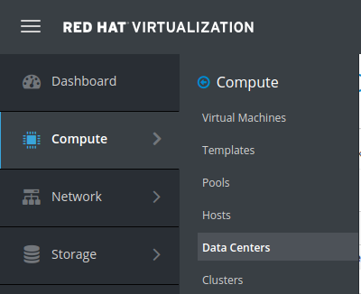
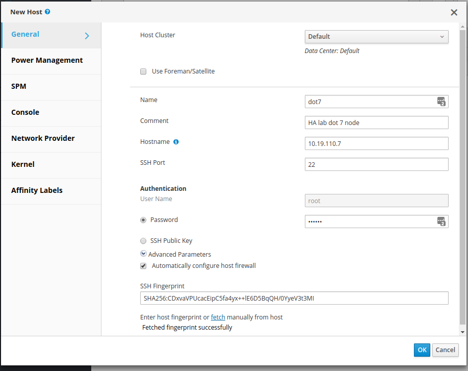
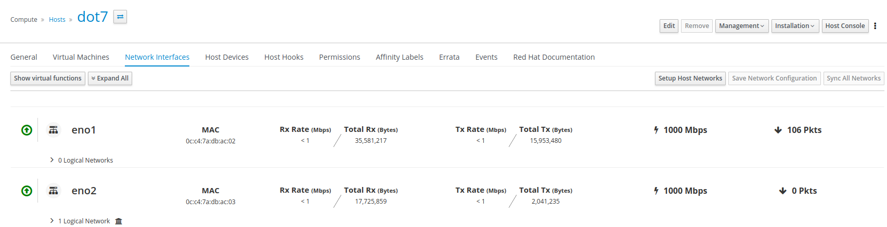
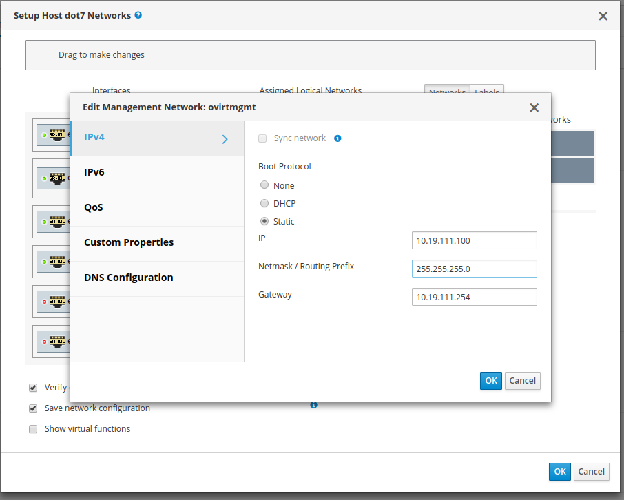

# telemetry-framework-rhv

Automation for installation of telemetry framework on RHV. Purpose of this repository
is to provide documentation and automation for:

* installing a RHV engine
* setting up a virtual machine host server
* importing a RHEL 7.5 template
* instantiating RHEL 7.5 virtual machines

Currently the documentation below covers installation of a single VM hosting the
RHV engine which uses the same node for the installation of managed VMs via the
RHV engine. Ultimately this will be expanded to multiple nodes, with the entire
system being automated via Ansible.

As this is in the proof-of-concept stage, we're leveraging a single node with some
manual configuration via the web interface, but that will eventually be converted
to automation using the `oVirt.infra` role.

# Prerequisites

You'll need Ansible 2.6 or later along with a host machine already running
RHEL 7.5. These instructions are generally applicable to oVirt as well but
some modification of configuration will be required. Installing on top of
CentOS for oVirt is not in scope, but easily done with some extra effort.

You'll also need a bastion host (your laptop, or another place to run the
Ansible playbooks against your host server).

# Topology

# DNS Configuration

It's assumed you've setup `dnsmasq` for your internal DNS lookups for the nodes, or
that you've manually added them to the `/etc/hosts` file on your bastion host and
the physical host, virtual machines etc (it's recommended that you have a real DNS
server setup for less overhead).

# Host Setup

Host setup will be dealt with in the following sections.

## Setup repositories and register RHEL

The following sections will be executed on your bastion host.

### Clone `telemetry-framework-rhv`

    mkdir -p ~/src/github/redhat-nfvpe/ && cd $_
    git clone https://github.com/redhat-nfvpe/telemetry-framework-rhv
    cd telemtry-framework-rhv
    ansible-galaxy install -r requirements.yml

### Setup `telemetry-framework-rhv` configuration

We need to create an inventory file that we'll be able to run our
playbooks against to setup the nodes. Here is an example inventory file
for the HA lab.

    cat > inventory/hosts.yml <<EOF
    all:
      hosts:
        manager:
          ansible_host: 10.19.110.80
          ansible_private_key_file: /home/lmadsen/.ssh/halabdot7
          ansible_user: cloud-user
          password_file: engine.yml
        virthost:
          ansible_host: 10.19.110.7
          ansible_private_key_file: /home/lmadsen/.ssh/id_rsa
          ansible_user: root
          password_file: virthost.yml
      children:
        virthosts:
          hosts:
            manager:
            virthost:
        engine:
          hosts:
            manager:
    # vim: set tabstop=2 shiftwidth=2 smartindent expandtab :
    EOF

### Create password files for RHEL subscription

Create two files with `ansible-vault` which will hold our credentials
and Red Hat subscription information.

    ansible-vault create vars/engine.yml
    ansible-vault create vars/virthost.yml
    
Then we need to put in some configuration contents to these files.

**vars/engine.yaml**

    ansible-vault edit vars/engine.yml
    
    ovirt_engine_setup_admin_password: admin
    engine_password: "{{ ovirt_engine_setup_admin_password }}"

    ovirt_repositories_rh_username: "user@email.tld"
    ovirt_repositories_rh_password: "secretpassword"
    ovirt_repositories_pool_ids:
        - 8a85....26ba

**vars/virthost.yaml**

    ansible-vault edit vars/virthost.yml
    
    ovirt_engine_setup_admin_password: admin
    engine_password: "{{ ovirt_engine_setup_admin_password }}"

    ovirt_repositories_target_host: host
    ovirt_repositories_rh_username: "user@email.tld"
    ovirt_repositories_rh_password: "secretpassword"
    ovirt_repositories_pool_ids:
        - 8a85....39e0

### Subscribe and setup repositories

With our subscription information all setup, we can run the `bootstrap.yml`
playbook to subscribe our server and setup the repositories.

    ansible-playbook -i inventory/hosts.yml \
      --limit virthost \
      --ask-vault-pass \
      playbooks/bootstrap.yml

## Download RHEL 7.5 cloud image

Connect to the host server at this point for this section.

You're downloading the image and _running the following commands on the **host** itself_.
In the next section we'll swap over to our bastion host to automate the rest.

Get the download link for your RHEL 7.5 cloud image from https://access.redhat.com/downloads/content/69/ver=/rhel---7/7.5/x86_64/product-software

You're looking for the latest _Red Hat Enterprise Linux 7.5 Update KVM Guest Image (20180925)_ (or newer).

Create a directory for the image to live.

    mkdir -p /home/images/engine/

Once you've done that, download it onto the host machine with `curl`. The image should live
in `/home/images/engine/`. We'll use this to spin up our initial `engine` virtual machine.

    curl https://access.cdn.redhat.com//content/origin/files/sha256/<unique_string>/rhel-server-7.5-update-4-x86_64-kvm.qcow2?_auth_=<unique_auth_from_link> \
      --output /home/images/engine/rhel-server-7.5-update-4-x86_64-kvm.qcow2
      
> **Invalid `resolv.conf` in guest image**
>
> By default, the guest image has `nameserver 192.168.122.1` in the `/etc/resolv.conf` file.
> Unfortunately this will cause us issues later on when we build the virtual machines for OpenShift
> because the DNS will need to time out each time we run, resulting in a very long installation
> process, and likely failure. To resolve this, we can use `virt-edit` to inline delete the
> invalid nameserver.
>
>     yum install guestfish -y
>     systemctl start libvirtd.service
>     virt-edit --expr 's/nameserver 192.168.122.1//g' \
>       -a /home/images/engine/rhel-server-7.5-update-4-x86_64-kvm.qcow2 /etc/resolv.conf

# RHV Engine virtual machine creation

Next up is creating our virtual machine for the engine. These commands are also
run on your bastion host.

## Setup `base-infra-bootstrap` inventory and vars

We'll leverage the work done in the `base-infra-bootstrap` repository to make
creating the initial virtual machine a little bit less tedious. We're running
the commands below on our bastion host.

    mkdir -p ~/src/github/redhat-nfvpe/ && cd $_
    git clone https://github.com/redhat-nfvpe/base-infra-bootstrap
    cd base-infra-bootstrap
    ansible-galaxy install -r requirements.yml

Create our `inventory` to point at the host.

    mkdir inventory/rhv_engine
    cat > inventory/rhv_engine/inventory <<EOF
    virt_host ansible_host=10.19.110.7 ansible_ssh_user=root

    [virthosts]
    virt_host

    [all:vars]
    ansible_ssh_common_args='-o StrictHostKeyChecking=no'
    EOF

Then create the `vars` for configuring the virtual machine.

    cat > inventory/rhv_engine/vars <<EOF
    centos_genericcloud_url: file:///home/images/engine/rhel-server-7.5-update-4-x86_64-kvm.qcow2
    image_destination_name: rhel-server-7.5-update-4-x86_64-kvm.qcow2
    host_type: "centos"
    images_directory: /home/images/engine
    spare_disk_location: /home/images/engine
    spare_disk_size_megs: 20480
    ssh_proxy_user: root
    ssh_proxy_host: 10.19.110.7
    vm_ssh_key_path: /home/lmadsen/.ssh/halabdot7
    install_openshift_ansible_deps: false

    # network configuration for bridged network on virtual machine
    bridge_networking: true
    bridge_name: br1
    bridge_physical_nic: "eno1"
    bridge_network_name: "br1"
    bridge_network_cidr: 10.19.110.0/24
    domain_name: dev.nfvpe.site

    # network configuration for spinup.sh in redhat-nfvpe.vm-spinup role
    system_network: 10.19.110.0
    system_netmask: 255.255.255.0
    system_broadcast: 10.19.110.255
    system_gateway: 10.19.110.254
    system_nameservers: 10.19.110.9
    system_dns_search: dev.nfvpe.site

    # list of virtual machines to create
    virtual_machines:
      - name: engine
        node_type: other
        system_ram_mb: 8192
        static_ip: 10.19.110.80

## Create engine virtual machine

    cd ~/src/github/redhat-nfvpe/base-infra-bootstrap
    ansible-playbook -i inventory/rhv_engine/inventory -e "@./inventory/rhv_engine/vars" playbooks/virt-host-setup.yml

# Engine Configuration

Engine configuration will be dealt with in the following sections.

## Subscribe and setup repositories

As done previously, we setup our `vars` file so that we can register the node and install
the repositories that we need to get RHV engine setup on the virtual machine. Run the
following commands to make this so.

    cd ~/src/github/redhat-nfvpe/telemetry-framework-rhv
    ansible-playbook -i inventory/hosts.yml \
      --limit engine \
      --ask-vault-pass \
      playbooks/bootstrap.yml

## Install RHV engine

Installation of RHV engine should be as simple as running the following commands:

    cd ~/src/github/redhat-nfvpe/telemetry-framework-rhv
    ansible-playbook -i inventory/hosts.yml --ask-vault-pass playbooks/engine-setup.yml

After that, you should be able to access the web console at
https://engine.dev.nfvpe.site/ovirt-engine/sso/login.html

Login by default (per above) is `admin / admin`.

# Post-Install Setup

The follow steps will require some interaction with the GUI available at the link provided
in [Install RHV Engine](#install-rhv-engine) for the web interface.

## Set Data Center to Local Storage

On the left bar, select `Compute > Data Centers`.

Then right-click on the `Default` data center.

Change the _Storage Type_ from _Shared_ to _Local_.

## Add a Host to the Data Center Cluster

Now we need to add our host to the engine so that it can be managed, allowing
us to create our virtual machines.

And then click on the _New_ button and create your host (which in our case
is the `10.19.110.7` host where we installed the RHV engine since we're
doing a single node installation here. If you have the RHV engine somewhere
else then you just add one or more hosts the same as we're doing here).

You should now have a host that says it is _Non-Operational_ because we need to
setup networking and storage for the node. If you received a failure then you'll
need to ebug why this is happening through the logs on the host and the engine VM.
The ogs should be mostly available in `/var/log/` under some `ovirt-` directories.

## Setup Networking

Before we setup the storage for the node, we need to add the `ovirtmgmt` virtual
interface to the node so that we can communicate with it properly. This will move
your networking around a bit, and setup your existing interface on `eno1` to be
on a bridged network `br1`. We'll be attaching `ovirtmgmt` to the `eno2` interface
since we'll be setting the nodes up for static addressing, and we don't want to
interfere with our existing DHCP network. Your networking requirements may differ.

First let's load up our `dot7` host.

Then click on the _Network Interfaces_ tab within the `dot7` host itself.

Click on _Setup Host Networks_ then drag the `ovirtmgmt` networking interface over
to the `eno1` physical interface. Before we make these changes, let's setup the
interface to have a static IP address of `10.19.111.100` since our `eno2` network
is designed to use `10.19.111.0/24` subnet.

And with everything configured we can now click on the _OK_ button in the network
configuration screen, and then in the _Setup Host dot7 Networks_ screen as well.

If you had an existing SSH connection running on `10.19.110.7` then your connection
may have been dropped. You should be able to connect back to the `10.19.111.100`
address we just asssigned to the `ovirtmgmt` interface on `eno2`.

## Setup Storage

Our next step is to create some directories and configure the _Storage Domains_
to store our images, templates, and virtual machines on the node. 

> **Local storage vs Shared storage**
> We're going to be using local storage (which doesn't allow us to scale the
> system past a single node all that cleanly). Future work here is to migrate
> to installation of GlusterFS, NFS, or another distributed storage system
> where we can leverage the _Shared_ storage method.

Login to the host (at `10.19.110.7`) and run the following commands to create
the proper directory structure, ownership, and filesystem permissions.

    mkdir -p /var/local/data/images
    chown 36:36 /var/local/data /var/local/data/images
    chmod 0755 /var/local/data /var/local/data/images

Now that we've configured our directories and setup the proper permissions and
ownership, we need to go back to the web interface and create _Storage Domains_
that get assigned to the host itself for storing of our virtual machine
templates and images.

Go to _Storage > Domains_ from the left menu.

Then we're going to create the new data domain by clicking on _New Domain_. We
need to configure the local storage to point at the directory we just created above.
The default drop down for _Storage Type_ is _NFS_ and we're going to change it
to _Local on Host_.

> **Future Storage**
> 
> As this is a POC we're setting this up fairly dirty, but in the future we'll
> convert this to shared storage using something like GlusterFS or NFS.

Once we've configured the storage, click on _OK_ and you should see a pop
up box saying the storage has been configured on the host.

# Templates and Virtual Machines

We're nearing the end of our configuration. We need to create the RHEL VM
templates, and then spin up some virtual machines from the template.

## Upload RHEL to the Engine

As we previously downloaded and modified the RHEL cloud image onto our host,
we'll use the same file and push it into the engine virtual machine so that
our templates can be setup with that same image. To start, we need to login
to our host machine, and then we'll `scp` the file over to the engine virtual
machine so that we can create our RHEL template with Ansible.

    ssh root@10.19.111.100
    cd /home/images/engine
    scp rhel-server-7.5-update-4-x86_64-kvm.qcow2 cloud-user@10.19.110.80:

## Create RHEL template on the engine

From our bastion host (laptop) we'll create the RHEL template with our
`telemetry-framework-rhv` repository and playbooks. Run the following commands
to import the RHEL image to the host and create our RHEL 7.5 VM template.

    cd ~/src/github/telemetry-framework-rhv/
    ansible-playbook -i inventory/hosts.yml --ask-vault-pass playbooks/rhel-template.yml

At this point, the final step is create the virtual machines for the OpenShift
installation. You will likely want to modify the topology/node list which we'll
discuss in the next section.

## Create RHEL virtual machines for OpenShift

There is a reference playbook that matches our initial topology diagram at the top
of this document. For larger installations, you simply need to adjust the YAML list
of machines that you want to have installed in your environment. We're just using
a simple 3 node deployment for the POC so that we limit the number of resources
required to get stood up.

The following is the default list of virtual machines that will be configured for
the service assurance framework. The requirement of 3 virtual machines is for the
installation of GlusterFS within OpenShift for storage and persistent volumes.

    vms:
      - name: openshift-master
        tag: openshift_master
        profile: "{{ openshift_node }}"
        cloud_init:
          host_name: openshift-master.dev.nfvpe.site
          nic_ip_address: 10.19.111.101
          root_password: redhat
          dns_servers: 10.19.110.9
          dns_search: dev.nfvpe.site
          nic_boot_protocol: static
          nic_netmask: 255.255.255.0
          nic_gateway: 10.19.111.254
          nic_on_boot: true
          nic_name: eth0
      - name: openshift-node-1
        tag: openshift_node
        profile: "{{ openshift_node }}"
        cloud_init:
          host_name: openshift-node-1.dev.nfvpe.site
          nic_ip_address: 10.19.111.102
          root_password: redhat
          dns_servers: 10.19.110.9
          dns_search: dev.nfvpe.site
          nic_boot_protocol: static
          nic_netmask: 255.255.255.0
          nic_gateway: 10.19.111.254
          nic_on_boot: true
          nic_name: eth0
      - name: openshift-node-2
        tag: openshift_node
        profile: "{{ openshift_node }}"
        cloud_init:
          host_name: openshift-node-2.dev.nfvpe.site
          nic_ip_address: 10.19.111.103
          root_password: redhat
          dns_servers: 10.19.110.9
          dns_search: dev.nfvpe.site
          nic_boot_protocol: static
          nic_netmask: 255.255.255.0
          nic_gateway: 10.19.111.254
          nic_on_boot: true
          nic_name: eth0

Instantiation of the virtual machines can be run from our `telemetry-framework-rhv`
source directory with Ansible, much like we've been doing previously. The following
commands are run on your bastion machine.

    cd ~/src/github/redhat-nfvpe/telemetry-framework-rhv
    ansible-playbook -i inventory/hosts.yml --ask-vault-pass playbooks/vm-infra.yml

After your virtual machines have instantiated, the next steps are to install your
OpenShift environment to the virtual machines.
