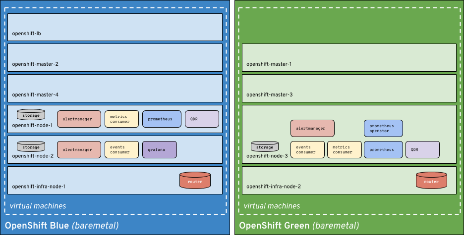

# Telemetry Platform Deployment

Instructions in this gist are for the deployment of the telemetry platform on top of OpenShift Origin v3.9. Deployment of
the platform is done in two (2) steps. The first step is bootstrap of the virtual hosts and installation of the virtual
machines (VM) on those virtual hosts (virthost).

# Prerequisites

* (optional) 2 physical machines with at least 32GB of memory (64GB+ recommended)
  * it's also possible to run this on a single machine if high available it not necessary
* IP space to allocate 1 address on your LAN per virtual machine (total 9)
* Network setup to allow for bridged networking of the virtual machines on the physical nodes
* (optional) DNSmasq setup to provide hostnames to virtual machines and wildcard domain
  * can also be handled externally via your router or other DNS setup
* Root SSH access via SSH keys to the physical hosts from control node (e.g. laptop)
* [CentOS Atomic resized to 30GB disk space](https://gist.github.com/leifmadsen/c0624f3f3ee0a43bff8a32b00ba4592c#file-atomic-resize-root-md) or RHEL 7.5 (as RPMs should be available for RHEL/CentOS now)
  * Preferred is CentOS or RHEL 7.5 (do not use Atomic going forward)
  * **IT IS IMPORTANT YOUR CLOUD IMAGE HAS ENOUGH SPACE FOR OPENSHIFT**
* Ansible 2.5

# Telemetry Platform Layout



# DNSMasq Configuration

    cat > /etc/dnsmasq.conf <<EOF
    log-facility=/var/log/dnsmasq.log
    interface=br1
    cache-size=300
    server=10.16.36.29
    server=10.11.5.19
    server=10.5.30.160
    server=127.0.0.1
    expand-hosts
    address=/apps.nfvpe.site/10.19.110.71
    no-resolv
    EOF

    systemctl restart dnsmasq.service

# Bootstrap and VM setup

> **NOTE**
>
> For production purposes, deployment of the 2 virtual machines should be done with something other than
> `base-infra-bootstrap`. The use of `base-infra-bootstrap` should only be done for development and testing purposes.

Initially we need to bootstrap our 2 virtual machines with KVM, get our CentOS Atomic image (see prerequisites for sizing),
and instantiate our virtual machines.

We can do this with [redhat-nfvpe.base-infra-bootstrap](https://github.com/redhat-nfvpe/base-infra-bootstrap) or any other
playbooks of your choosing. The important thing is to provide the virtual machines on 2 physical hosts on a network that
you can do bridged networking on.

So let's clone the repository and get our inventory and variable files setup.

## Clone `base-infra-bootstrap`

    mkdir ~/src/github/redhat-nfvpe/
    cd ~/src/github/redhat-nfvpe/
    git clone https://github.com/redhat-nfvpe/base-infra-bootstrap
    cd base-infra-bootstrap/
    ansible-galaxy install -r requirements.yml
    
## Configure `blue` node inventory and variable file

> **Pro Tip**
>
> If you want to converge the servers onto a single physical node, you can use the `blue.inventory` file for
> both the `blue` and `green` deployments. You'll still need to create both the `blue.vars` and `green.vars`
> files.

**inventory**

    cat > inventory/blue.inventory <<EOF
    virt_host ansible_host=10.19.110.9 ansible_ssh_user=root

    [virthosts]
    virt_host

    [all:vars]
    ansible_ssh_common_args='-o StrictHostKeyChecking=no'
    EOF

**variables**

    cat > inventory/blue.vars <<EOF
    centos_genericcloud_url: https://cloud.centos.org/centos/7/images/CentOS-7-x86_64-GenericCloud.qcow2
    image_destination_name: CentOS-7-x86_64-GenericCloud.qcow2
    host_type: "centos"
    images_directory: /home/images/telemetry
    spare_disk_location: /home/images/telemetry
    ssh_proxy_user: root
    ssh_proxy_host: 10.19.110.9
    vm_ssh_key_path: /home/lmadsen/.ssh/blue
    
    # network configuration for bridged network on virtual machine
    bridge_networking: true
    bridge_name: br1
    bridge_physical_nic: "eno1"
    bridge_network_name: "br1"
    bridge_network_cidr: 10.19.110.64/28
    domain_name: nfvpe.site

    # network configuration for spinup.sh in redhat-nfvpe.vm-spinup role
    system_network: 10.19.110.0
    system_netmask: 255.255.255.0
    system_broadcast: 10.19.110.255
    system_gateway: 10.19.110.254
    system_nameservers: 10.19.110.9
    system_dns_search: nfvpe.site

    # list of virtual machines to create
    virtual_machines:
      - name: openshift-lb
        node_type: lb
        system_ram_mb: 4096
        static_ip: 10.19.110.64
      - name: openshift-master-2
        node_type: nodes
        system_ram_mb: 8192
        static_ip: 10.19.110.66
      - name: openshift-node-1
        node_type: nodes
        system_ram_mb: 16384
        static_ip: 10.19.110.68
      - name: openshift-node-2
        node_type: nodes
        system_ram_mb: 16384
        static_ip: 10.19.110.69
      - name: openshift-infra-node-1
        node_type: nodes
        system_ram_mb: 4096
        static_ip: 10.19.110.71
    EOF

## Configure `green` node inventory and variable file

**inventory**
    
    cat > inventory/green.inventory <<EOF
    virt_host ansible_host=10.19.110.11 ansible_ssh_user=root

    [virthosts]
    virt_host

    [all:vars]
    ansible_ssh_common_args='-o StrictHostKeyChecking=no'
    EOF

**variables**

    cat > inventory/green.vars <<EOF
    ---
    centos_genericcloud_url: https://cloud.centos.org/centos/7/images/CentOS-7-x86_64-GenericCloud.qcow2
    image_destination_name: CentOS-7-x86_64-GenericCloud.qcow2
    host_type: "centos"
    images_directory: /home/images/telemetry
    spare_disk_location: /home/images/telemetry
    ssh_proxy_user: root
    ssh_proxy_host: 10.19.110.11
    vm_ssh_key_path: /home/lmadsen/.ssh/green
    
    # network configuration for bridged network on virtual machine
    bridge_networking: true
    bridge_name: br1
    bridge_physical_nic: "eno1"
    bridge_network_name: "br1"
    bridge_network_cidr: 10.19.110.64/28
    domain_name: nfvpe.site
    
    # network configuration for spinup.sh in redhat-nfvpe.vm-spinup role
    system_network: 10.19.110.0
    system_netmask: 255.255.255.0
    system_broadcast: 10.19.110.255
    system_gateway: 10.19.110.254
    system_nameservers: 10.19.110.9   # not an error; DNSmasq running on .9
    system_dns_search: nfvpe.site

    # list of virtual machines to create
    virtual_machines:
      - name: openshift-master-1
        node_type: master
        system_ram_mb: 8192
        static_ip: 10.19.110.65
      - name: openshift-master-3
        node_type: master
        system_ram_mb: 8192
        static_ip: 10.19.110.67
      - name: openshift-node-3
        node_type: nodes
        system_ram_mb: 16384
        static_ip: 10.19.110.70
      - name: openshift-infra-node-2
        node_type: nodes
        system_ram_mb: 4096
        static_ip: 10.19.110.72
    EOF

## Configure `telemetry.inventory` file for OpenShift deployment

    cat > inventory/telemetry.inventory <<EOF
    # vim: set ft=yaml shiftwidth=2 tabstop=2 expandtab :
    openshift-lb ansible_host=openshift-lb.nfvpe.site
    openshift-master-1 ansible_host=openshift-master-1.nfvpe.site
    openshift-master-2 ansible_host=openshift-master-2.nfvpe.site
    openshift-master-3 ansible_host=openshift-master-3.nfvpe.site
    openshift-node-1 ansible_host=openshift-node-1.nfvpe.site
    openshift-node-2 ansible_host=openshift-node-2.nfvpe.site
    openshift-node-3 ansible_host=openshift-node-3.nfvpe.site
    openshift-infra-node-1 ansible_host=10.19.110.71
    openshift-infra-node-2 ansible_host=10.19.110.72

    [OSEv3:children]
    masters
    nodes
    etcd
    glusterfs
    lb

    [OSEv3:vars]
    ansible_become=yes
    debug_level=4

    # install telemetry
    sa_telemetry_install=true
    sa_telemetry_namespace=sa-telemetry

    # storage
    openshift_storage_glusterfs_namespace=glusterfs
    openshift_storage_glusterfs_name=storage
    openshift_storage_glusterfs_storageclass_default=true

    # service broker
    openshift_enable_service_catalog=true
    openshift_service_catalog_image_version=v3.9

    # main setup
    openshift_disable_check=disk_availability,memory_availability,docker_image_availability
    openshift_master_identity_providers=[{'name': 'htpasswd_auth', 'login': 'true', 'challenge': 'true', 'kind': 'HTPasswdPasswordIdentityProvider', 'filename': '/etc/origin/master/htpasswd'}]
    openshift_deployment_type=origin
    openshift_release=v3.9
    enable_excluders=false
    openshift_clock_enabled=true

    # Native HA
    openshift_master_cluster_method=native
    openshift_master_cluster_hostname=master.nfvpe.site
    openshift_master_cluster_public_hostname=console.nfvpe.site

    # hostname setup
    openshift_hostname_check=true
    openshift_master_default_subdomain=apps.nfvpe.site

    # ansible service broker
    ansible_service_broker_registry_user=<DOCKER_HUB_USERNAME>
    ansible_service_broker_registry_password=<DOCKER_HUB_PASSWORD>
    ansible_service_broker_registry_organization=ansibleplaybookbundle
    ansible_service_broker_registry_whitelist=[".*-apb$"]
    ansible_service_broker_local_registry_whitelist=[".*"]

    [masters]
    openshift-master-1
    openshift-master-2
    openshift-master-3

    [etcd]
    openshift-master-1
    openshift-master-2
    openshift-master-3

    [lb]
    openshift-lb

    [nodes]
    openshift-master-[1:3] openshift_node_labels="{'region': 'infra', 'zone': 'default'}"
    openshift-node-1 openshift_node_labels="{'region': 'primary', 'zone': 'default', 'node': 'blue'}"
    openshift-node-2 openshift_node_labels="{'region': 'primary', 'zone': 'default', 'node': 'blue'}"
    openshift-node-3 openshift_node_labels="{'region': 'primary', 'zone': 'default', 'node': 'green'}"
    openshift-infra-node-1 openshift_node_labels="{'region': 'infra', 'zone': 'default', 'node': 'blue'}"
    openshift-infra-node-2 openshift_node_labels="{'region': 'infra', 'zone': 'default', 'node': 'green'}"

    [glusterfs]
    openshift-node-[1:3]

    [glusterfs:vars]
    glusterfs_devices=[ "/dev/vdb" ]
    r_openshift_storage_glusterfs_use_firewalld=false
    r_openshift_storage_glusterfs_firewall_enabled=true
    openshift_storage_glusterfs_timeout=900
    openshift_storage_glusterfs_wipe=true

    [all:vars]
    ansible_user=centos
    EOF

# Deployment of virtual machines

Now that we have our configuration setup (make sure you review the hostnames, IP addresses, subnet ranges, DockerHub login,
etc), we can build out our deployment and get the virtual machines setup.

## Spin up virtual machines

We can spin up our virtual machines on our two physical hosts. We'll do this by passing the two sets of `inventory` and
`vars` files to `ansible-playbook`, which will bootstrap our physical machines and start up the VMs.

> **NOTE**
> 
> This has been tested on both CentOS 7 and RHEL 7, however on RHEL you'll need to make sure your system is registered
> and subscribed to a pool that will provide KVM.

### Deploy `blue` nodes

    cd ~/src/github/redhat-nfvpe/base-infra-bootstrap/
    ansible-playbook -i inventory/blue.inventory -e "@./inventory/blue.vars" playbooks/virt-host-setup.yml

### Deploy `green` nodes

    cd ~/src/github/redhat-nfvpe/base-infra-bootstrap/
    ansible-playbook -i inventory/green.inventory -e "@./inventory/green.vars" playbooks/virt-host-setup.yml

### (optional) Deploy all nodes in one command

    cd ~/src/github/redhat-nfvpe/base-infra-bootstrap/
    for n in blue green; do ansible-playbook -i inventory/$n.inventory -e "@./inventory/$n.vars" playbooks/virt-host-setup.yml
    
Alternatively, install everything onto the same physical machine with a single inventory file.

    cd ~/src/github/redhat-nfvpe/base-infra-bootstrap/
    for n in blue green; do ansible-playbook -i inventory/blue.inventory -e "@./inventory/$n.vars" playbooks/virt-host-setup.yml

## Teardown of virtual machines (optional)

If you've run through this once and wanto do a teardown of the virtual machines, you can do that with the `vm-teardown.yml`
playbook in `base-infra-bootstrap`.

    ansible-playbook -i inventory/blue.inventory -e "@./inventory/blue.vars" playbooks/vm-teardown.yml
    ansible-playbook -i inventory/green.inventory -e "@./inventory/green.vars" playbooks/vm-teardown.yml

# Deployment of OpenShift

The last step is to deploy OpenShift and run the `sa-telemetry/config.yml` playbook to setup the telemetry platform
on your virtual machines. We'll do this with [`openshift-ansible`](https://github.com/openshift/openshift-ansible),
which will be cloned and patched via the `telemetry-framework/scripts/bootstrap.sh` script.

## Clone `redhat-nfvpe.telemetry-framework`

    cd ~/src/github/redhat-nfvpe/
    git clone https://github.com/redhat-nfvpe/telemetry-framework
    cd telemetry-framework
    ./scripts/bootstrap.sh
    
## Load virtual machine keys into ssh-agent

Your deployment for OpenShift will fail due to an inability to connect to the virtual hosts if you don't add
the SSH keys that were generated during the `base-infra-bootstrap` deployment. You can do this with `ssh-add`.

```
ssh-add ~/.ssh/blue
ssh-add ~/.ssh/green
```

## Deploy OpenShift

Now we'll deploy OpenShift with our `telemetry.inventory` file that we created in `base-infra-bootstrap/inventory/`
earlier in this documentation. Be sure you've reviewed the file, made any modifications necessary, and have your DNS
setup. Without DNS setup properly, things will fail.

    cd ~/src/github/redhat-nfvpe/base-infra-bootstrap
    export _BASEINFRABOOTSTRAP=`pwd`
    cd ~/src/github/redhat-nfvpe/telemetry-framework/working/openshift-ansible
    ansible-playbook -i $_BASEINFRABOOTSTRAP/inventory/telemetry.inventory \
        playbooks/prerequisites.yml \
        playbooks/deploy_cluster.yml

# Post-Deploy Configuration

> **TODO**: there is likely nothing that you need to do post-deployment other than the ElasticSearch
> setup as documented below.

There are a couple of post-deployment items that should be done. Previously more actions needed to be done, but those
have now been automated in the `sa-telemetry-postinstall` role.

## Add ssh keys into ssh-agent

From your control machine (i.e. laptop), you may need to load the `blue` and `green` SSH keys into the ssh-agent so you
can connect to the remote hosts.

    ssh-add ~/.ssh/blue
    ssh-add ~/.ssh/green

Validate you can login to the remote nodes with something like `ssh centos@10.19.110.65` (`openshift-master-1`).

## Deploy ElasticSearch Cluster from Catalog

The automation does not automatically deploy ElasticSearch for you (which is required for events). You'll do this through
the web interface using the catalog. If you've gotten the Automation Broker (aka Ansible Service Broker) working (which
should be done if you've used the supplied inventory file), then you can click on the `ElasticSearch (APB)` catalog item
and deploy an ElasticSearch cluster.

Use the persistent storage version of the cluster deployment, set the cluster size to 2 or more, and create the secret
token during deployment so that it can live in the `sa-telemetry` namespace. Creating a route should not be necessary
unless you want to access the web interface. An internal service will be automatically created, and the Events Consumer
container should already be configured by default to attempt to connect to it.
