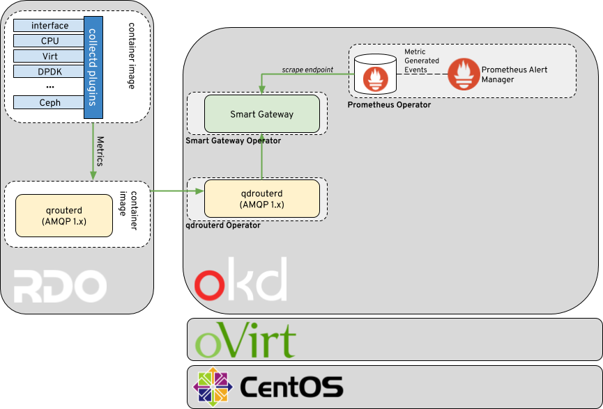

Architecture
============

The telemetry framework is ultimately a metrics collection and storage tool
leveraging Prometheus for the time-series data storage, and an AMQP 1.x
compatible messaging bus for shuttling the metrics information back to
Prometheus.

On the client side collectd is used for collecting the high resolution metrics.
The metrics are then delivered to Prometheus using the AMQP1 plugin in order to
place the data onto the message bus. On the server side, a small Golang
application called the Smart Gateway takes the data stream from the bus, and
exposes it as a local scrape endpoint for Prometheus.

In our reference architecture above, we are collecting data within an RDO
OpenStack cloud from a containerized collectd and qdrouterd (Apache QPID
Dispatch Router) that ships the metrics to a corresponding qdrouterd on the
telemetry framework side.

The telemetry framework is a micro-service based application that runs within
an OKD (OpenShift) environment. The deployment of OKD is typically run within a
public or private cloud as virtual machines. Our setup is to leverage a
hyperconverged deployment of oVirt in order to provide a minimal local
environment for OKD while maintaining the high availability aspects that we
desire. Our choice operating system is CentOS.
