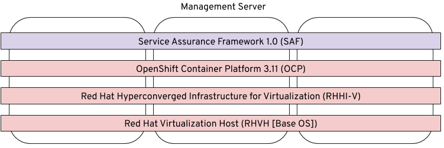

=====================
Platform Installation
=====================

.. admonition:: Why are you documentating the downstream version?

    As we noted in the :ref:`ProjectOverview` we are documenting the downstream
    components initially for the deployment of the telemetry framework. We will
    note the upstream equivalent where possible.

The installation of the telemetry framework simply requires the deployment of
OpenShift 3.11 or later and a bastion node for executing the supplied `bash`
script to load the components into the `sa-telemetry` namespace.

Our reference implementation leverages 3 physical nodes using RHHI-V platform
which provides us with virtualization and distributed storage.

The layers are shown in the following diagram.

Installation of RHVH, RHHI-V, and OpenShift are beyond the scope of this
documentation but we'll link to existing documentation in the following
sections, and describe any example configurations, or other useful information
to make installation more reproducible.

We'll build up the platform layer by installing a 3 node RHHI-V on top of RHVH
and then creating the virtual machines in RHHI-V, setting up affinity,
networking, etc prior to deploying OpenShift.

Installing Red Hat Virtualization Host (RHVH) Operating System
==============================================================

.. admonition:: Upstream equivalent of RHVH

    RHVH is the Red Hat Virtualization Host, a spin of RHEL with the specific
    repositories required to install RHHI-V. Installation of `CentOS 7.6
    <https://centos.org>`__ or later should contain the required dependencies
    for an upstream installation.

First we need to install RHVH (Red Hat Virtualization Host). This needs to be
done on 1 or 3 nodes (or groups of 3) so that we can do the installation of
RHHI-V (Red Hat Hyperconverged Infrastructure for Virtualization) next.

Your node will need at least 2 physical disks; one for the installation of the
operating system, and one blank disk for the GlusterFS system. If you have
additional disks you can use these in either a RAID configuration for
GlusterFS, or break the storage classes GlusterFS will setup across multiple
disks.

See the `official Red Hat Virtualization Hosts installation guide
<https://access.redhat.com/documentation/en-us/red_hat_virtualization/4.2/html/installation_guide/red_hat_virtualization_hosts>`__
for obtaining RHVH and installing it.

The following procedure is how we're installing in the lab.

* Boot the RHVH 4.2.8 (or later) ISO for the node, or somehow automate the
  installation of RHVH with Satellite or other.
* Copy your local ssh key onto the nodes
  ::

      for i in 1 2 3; do ssh-copy-id -i ~/.ssh/id_rsa.pub root@virthost$i.management.service-assurance.tld; done

* Login to each of the servers via SSH
* Create an ssh key and make sure you can ssh into localhost without a password
  ::

    ssh-keygen -t rsa -b 2048 -q -f ~/.ssh/id_rsa
    ssh-copy-id -i ~/.ssh/id_rsa.pub root@$(hostname -f)

  * EXAMPLE
    ::

        # this one is for copying the key to all systems with various subdomains
        for d in storage management home; do $(for i in 1 2 3; do ssh-copy-id -i ~/.ssh/id_rsa root@virthost$i.$d.service-assurance.tld; done); done

* (optional) Possibly setup the ``/etc/resolv.conf`` to point at your local DNS
  server if necessary and ``chattr +i /etc/resolv.conf`` to lock it (needed in
  my lab, no control of the DHCP server)

  * In a proper environment this will not be necessary, but DNS is very
    important for proper operation of the environment as a whole

* Register the nodes
  ::

    subscription-manager register --username="<email>" --password='<password>'
    subscription-manager list --available --matches="<YOUR_SKU>" --pool-only
    subscription-manager attach --pool=<pool from list>

    # alternatively do in a single command using the first item returned
    subscription-manager attach --pool=$(subscription-manager list --available --matches="<YOUR_SKU>" --pool-only | head -n1)

* Enable subscriptions and update systems
  ::

    subscription-manager repos --enable=rhel-7-server-rhvh-4-rpms
    yum update -y

* Wipe all the disks being used for GlusterFS to make sure they are blank.

  .. warning:: Of course update the list of disk paths below to match your own
     environment.

  * Wipe the disks
    ::

        wipefs -f -a /dev/sdb
        wipefs -f -a /dev/sdc
        wipefs -f -a /dev/sdd

        # this will wipe out any master boot record (MBR) data
        dd if=/dev/zero of=/dev/sdb bs=512 count=1 conv=notrunc

* Note the size of the disks in GB, which you’ll need for the next section
  ::

    fdisk -s /dev/sdd | awk '{$1=$1/(1024^2); print $1,"GB";}'

    # or...
    lsblk

* Go to the web interface via
  ``https://virthost1.management.service-assurance.tld:9090`` to
  start installation of RHHI-V.

Installing Red Hat Hyperconverged Infrastructure for Virtualization (RHHI-V)
============================================================================

.. admonition:: Upstream equivalent of RHHI-V

    More information about deploying oVirt hyperconverged in a 1 or 3 node
    configuration is available at `oVirt Gluster-Hyperconverged documentation
    <https://ovirt.org/documentation/gluster-hyperconverged/chap-Introduction.html>`__.

Official documentation for installation of RHHI-V can be found at `Chapter 6.
Configure Red Hat Gluster Storage For Hosted Engine Using The Cockpit UI
<https://access.redhat.com/documentation/en-us/red_hat_hyperconverged_infrastructure_for_virtualization/1.5/html/deploying_red_hat_hyperconverged_infrastructure_for_virtualization/task-config-rhgs-using-cockpit>`__

In the previous section titled `Installing Red Hat Virtualization Host (RHVH)
Operating System`_ we mentioned the creation of SSH keys and populating them
among the various hosts. That is required during the installation of RHHI-V
since it executes Ansible from the web interface to build the virtual machine
for the engine, and to create the GlusterFS storage domains.

Download RHEL 7.6 KVM Image Onto Bastian Host
---------------------------------------------

With RHHI-V now installed, we need to download a copy of the RHEL 7.6 KVM image
which will be the source operating system during installation of OpenShift. You
can download the image from `https://access.redhat.com
<https://access.redhat.com/downloads/content/69/ver=/rhel---7/7.6/x86_64/product-software>`_.

Get your download link (which is time sensitive and must be obtained each time
you wish to download a new image) and download it onto your bastian host (or
any other host where you can install ``guestfish`` which we'll discuss next).
::
cd /tmp
curl ‘http://access.cdn.redhat.com/…’ -o rhel-server-7.6-x86_64-kvm.qcow2

Modify RHEL 7.6 KVM Image and Upload To RHV-M Engine
----------------------------------------------------

Before importing the template into the system, you’ll need to run some
``guestfish`` commands to strip out the default ``192.168.122.1`` nameserver
which can cause us issues as we'll be running the virtual machines with bridged
network interfaces.
::

    yum install guestfish -y
    systemctl start libvirtd.service
    virt-edit --expr 's/nameserver 192.168.122.1//g' \
        -a /tmp/rhel-server-7.6-x86_64-kvm.qcow2 /etc/resolv.conf

We can now upload our modified virtual machine image to the RHV-M engine with
``scp`` or another method. Our Ansible for creating the ``rhel76_template`` in
RHHI-V will expect the virtual machine image file to be located in the
``/root`` directory on the RHV-M engine.
::

    scp /tmp/rhel-server-7.6-x86_64-kvm.qcow2 root@engine.rhhi-v.tld

Installing OpenShift
====================

.. admonition:: Upstream equivalent of OpenShift

    The upstream OpenShift project is known as `OKD <https://okd.io>`__ and is
    the Red Hat distribution of `Kubernetes <https://kubernetes.io>`__.
    Documentation for installation of OKD 3.11 is available at `docs.okd.io
    <https://docs.okd.io/3.11/welcome/index.html>`__.

Installation of OpenShift within RHHI-V is done with Ansible playbooks and
roles as created within the ``rhhi-v/`` subdirectory of the
``telemetry-framework`` repository.

The first step is creating an inventory file that will result in the creation
of the virtual machines within the RHHI-V environment and then subsequently
execute ``openshift-ansible`` to install the OpenShift platform within the
virtual machines.

Both upstream and downstream deployment methods use the same automation and the
primary difference is that when installing the downstream version of OpenShift
an extra variables file will be required that contains the information for
registration of OpenShift and pulling the components from another repository.

Creating Virtual Machine and OpenShift Inventory Files
------------------------------------------------------

A few example inventory files for our lab configuration exist within the
``rhhi-v/inventory/`` directory. We'll create a new inventory configuration
based on a working example.

On your bastian host clone the `telemetry-framework
<https://github.com/redhat-service-assurance/telemetry-framework>`__ repository
and create a new directory in the ``rhhi-v/inventory/`` directory.
::

    mkdir -p ~/src/github.com/redhat-service-assurance
    cd ~/src/github.com/redhat-service-assurance
    git clone https://github.com/redhat-service-assurance/telemetry-framework
    cd telemetry-framework/rhhi-v
    mkdir inventory/my_lab

With our new directory created, we need two inventory files to deploy our
infrastructure on top of RHHI-V; ``hosts.yml`` and ``openshift.yml``.

The ``hosts.yml`` file will contain the information required to instantiate and
configure the virtual machines in RHHI-V in preparation for our OpenShift
installation.

Virtual Machines Inventory File
~~~~~~~~~~~~~~~~~~~~~~~~~~~~~~~

The ``hosts.yml`` file is relatively long, but most of it is boilerplate that
you can use to build out your own hosts file. An example inventory file is
available in ``rhhi-v/inventory/nfvha-lab/hosts.yml``.

OpenShift Inventory File
~~~~~~~~~~~~~~~~~~~~~~~~

The ``openshift.inventory`` file is used by ``openshift-ansible`` to configure
your OpenShift cluster. An example ``openshift.inventory`` file that works with
the ``hosts.yml`` file for creating the virtual machines, is available in the
``rhhi-v/inventory/nfvha-lab/openshift.inventory`` file.

Create Variables Files
~~~~~~~~~~~~~~~~~~~~~~

We need a file that contains our login information for registering our RHEL
virtual machines.

Importing RHEL 7.6 Template Into RHHI-V
---------------------------------------

.. code-block:: bash

   ansible-galaxy install -r requirements.yml
   ansible-playbook -i inventory/nfvha-lab/ \
        --ask-vault-pass playbooks/rhel-template.yml

Instantiate The OpenShift Cluster on RHHI-V
-------------------------------------------

.. code-block:: bash

    # make sure you edit your inventory files first
    cd telemetry-framework/rhhi-v/
    ansible-playbook -i inventory/nfvha-lab/ \
        --ask-vault-pass -e “@./vars/rhsub.vars” playbooks/vm-infra.yml

