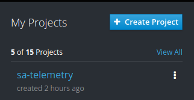
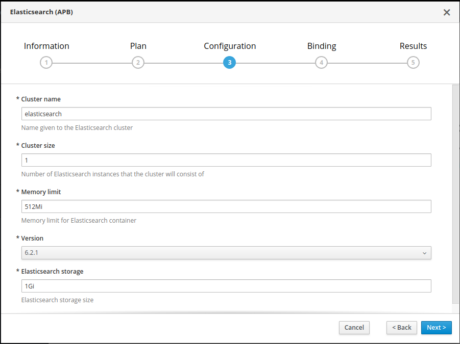
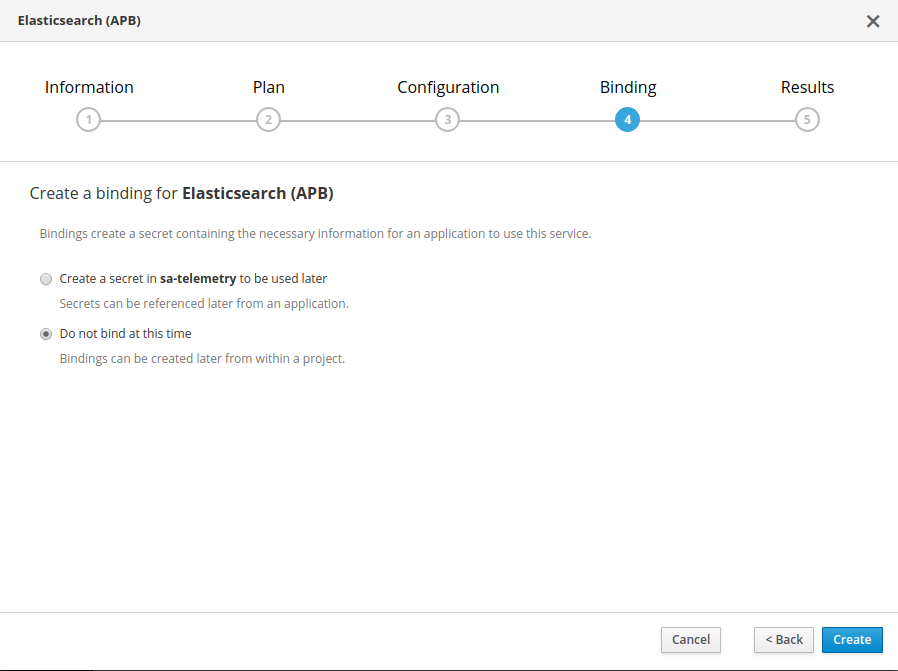
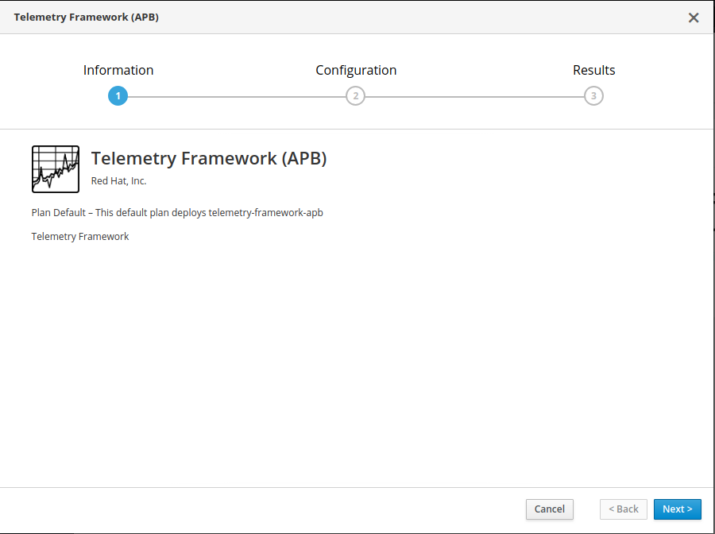
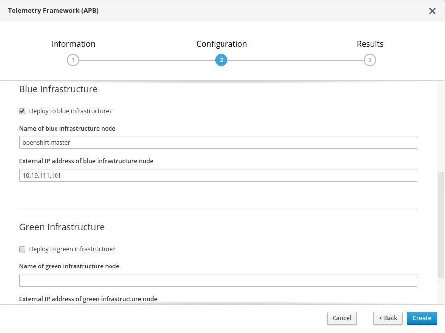

# Installing Telemetry Framework

Installation of the telemtry framework can be installed via the OpenShift
service catalog using the Ansible Service Broker. The installation and
configuration of the telemetry framework components is handled with Ansible
through a temporary container that is packaged as an Ansible Playbook Bundle
(APB).

# Select `sa-telemetry` Project

It's expected that you're installing telemetry framework into the
`sa-telemetry` project. You can select this from the right hand menu in the
_Browse Catalog_ screen.

# Install ElasticSearch via APB

The only prerequisite for installation of all components of telemetry framework
is ElasticSearch, which the _events consumer_ will connect to. You can select
the _ElasticSearch (APB)_ icon from the catalog.

Then we'll move through the installer guide. Click _Next_ on the _Information_
screen.

Select either _Ephemeral Installation_ or _Persistent Installation_. The
preference should be _Persistent Installation_, but will require that your
OpenShift cluster has a backing storage system like GlusterFS setup to allow
persistent volume claims and their related persistent volume.

Then we'll need to configure the resources we're going to give ElasticSearch.
If you're just testing out, the defaults are fine. If you have other
requirements, then set them now.

Then we'll click _Create_ on the _Binding_ screen as we don't need to create a
binding for ElasticSearch for the telemetry framework.

Wait for ElasticSearch to be instantiated fully and then install the telemetry
framework with the same method.

# Install Telemetry Framework via APB

With ElasticSearch active, we can install the Telemtry Framework. We'll do this
with the same method as before from the Service Catalog.

Click on the _Telemetry Framework (APB)_ icon which will load up the
_Information_ screen, then click _Next_.

Now we need to fill in 2 (or 3) sections:

* OpenShift Credentials
* Blue Infrastructure
* Green Infrastructure (optional)

> **Blue vs Blue/Green Installation**
>
> When installing, the Green infrastructure data is optional since you can
> deploy in a non-high availability setup with minimal infrastructure.
>
> For example, if you have a single master and 2 compute nodes (for 3 virtual
> nodes total) then you would only use the blue infrastructure since you only
> have a single infrastructure node (router) as openshift-master. If you create
> a redundant structure such as with a load balancer, 3 masters, multiple
> compute, and at least 2 infrastructure nodes, then you could use both blue
> and green deployments, with the infrastructure nodes (routers) being the 2
> endpoints for each of the blue and the green infrastructure.
>
> You'll also need to make sure your nodes have been labeled for blue and green
> properly so that your workloads are distributed across the nodes for your
> blue and green physical machines.

You'll need to know the cluster administrator login, along with the node name
and IP address of an infrastructure node in your environment.

Once the data has been entered, click on the _Create_ button. Go back to the
_Overview_ screen to monitor the progress of installation.

# Conclusion

You now have the Telemetry Framework components installed. See the
_Applications -> Routes_ for a list of routes to the various components.
