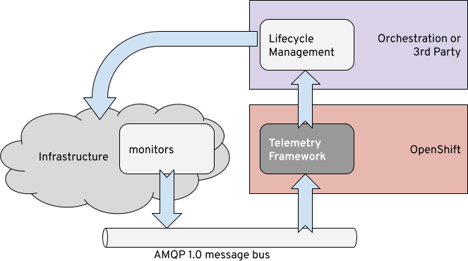

Why Telemetry Framework?
=======================

In the modern datacenter, things are dynamic. Infrastructure needs to be
monitored at a high polling interval, and actions taken quickly. Our
environments are dynamic, constantly changing in the cloud era. An ability to
monitor and react to these changing conditions with a strong degree of
flexability is why the telemetry framework was created.

The telemetry framework is itself a dynamic application running atop OpenShift
(Kubernetes) using several components such as Prometheus, the Smart Gateway,
collectd and the Apache QPID Dispatch Router. With a strong desire for low
latency in message delivery and high resolution information, the telemetry
framework is an excellent core to building the information to automatically
react to situations in your cloud infrastructure.

The telemetry framework gives you the core functionality to start gathering
data, storing it, and then reacting to it. With Prometheus Alertmanager you can
build rules that will create metrics-driven events that allow for notifications
to various endpoints. The flexibility of the Prometheus time-series database
can allow for predicting imminent failures before they happen.

You can add other systems as well to provide things like graphing, data
correlation, traps, and automation.
