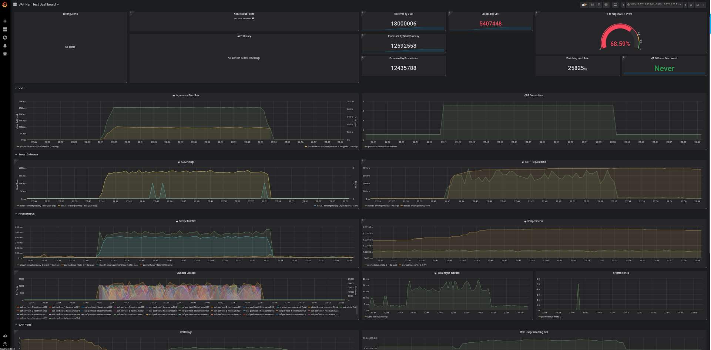

# SAF Performance Test

## Introduction

The performance test provides an automated environment in which to to run stress
tests on SAF. Collectd-tg or telemetry-bench are used to simulate extensive
metrics data to pump through SAF. Results of testing can be analyzed in a
grafana dashboard.

Two additional pods are deployed by the performance test: one that hosts a
grafana instance and one that executes the testing logic.



## Environment

* openshift v3.11.135
* docker v17.05+

## Setup

SAF must already be deployed, a quick way to do this is using the
`quickstart.sh` script in `telemetry-framework/deploy/` directory to run SAF.
Here is an example of how to do that in minishift:

>NOTE: if you intend to rebuild any test containers, your openshift must have an
>external route for the registry. The command for that is included here.

```shell
minishift addons enable registry-route   # Run BEFORE starting minishift
minishift start
eval $(minishift oc-env)
cd $WORKDIR/telemetry-framework/deploy/; ./quickstart.sh
```

More details about deploying SAF can be found in the
[SAF deployment docs](../../../docs/README.adoc#quickstart-script-for-development-usage)

## Deploying Grafana

Ensure that all of the SAF pods are already marked running with `oc get pods`.
Next, launch the grafana instance for test results gathering. This only needs
to be done once:

```shell
cd $WORKDIR/telemetry-framework/tests/performance-test/deploy
./grafana-launcher.sh
```

The grafana launcher script will output a URL that can be used to log into the
dashboard. This Grafana instance has all authentication disabled - if, in the
future, the performance test should report to an authenticated grafana instance,
the test scripts must be modified.

## Launching the test

Once the Grafana instance is running, launch the performance test OpenShift job:

```shell
./performance-test.sh
```

Monitor the performance test status by watching the job with
`oc get job -l app=saf-performance-test -w`. Logs can be viewed with
`oc logs saf-perftest-<NUM>-runner-<ID> -f`

## [DEPRECATED] Support for collectd-tg as a test tool

Currently we favor telemetry-bench because it:

* Makes predictable instead of random metrics
* Can generate exactly the number of metrics we ask for
* Can scale up to multiple instances by varying the hostname prefix
* Has a codebase we control directly

Collectd-tg has it's place in some collectd->QDR related testing, so we are
preserving these artifacts for now

### [DEPRECATED] Building the collectd-tg test container

>NOTE: This container is also available here: quay.io/plmr/performance-test:dev
>and the job will pull it from there by default; this documentation is simply
>being preserved to aid in any future revival of collectd-tg tooling.

OpenShift does not have a recent enough Docker engine to execute multistage
builds. As a result, the performance test image must be built locally with
docker v17.05 or higher and pushed to the openshift internal docker registry.

The registry needs to be configured such that a local docker image can
be pushed to it. To do this, a new openshift user must be created that has
admin privledges. The default admin account cannot be used because it does not
provide a token with which to login to the registry with docker.

```shell
oc login -u developer -p passwd   # create new user if it does not already exist
oc login -u system:admin
oc adm policy add-cluster-role-to-user cluster-admin developer  # give user admin privlidges
oc login -u developer -p passwd
oc project sa-telemetry          # must use same project as SAF
```

The openshift registry must be registered as an insecure registry for the local
docker daemon to be able to push to it. On Fedora 30, this can be done like so:

```shell
$ echo { \"insecure-registries\" : [\"$(oc get route docker-registry -n default -o jsonpath='{.spec.host}')\"] } \
| sudo tee  /etc/docker/daemon.json # add -a if you wish to preserve other insecure registry configurations
$ sudo systemctl daemon-reload
$ sudo systemctl restart docker
$ docker login -u developer -p $(oc whoami -t) $(oc get route docker-registry -n default -o jsonpath='{.spec.host}') # log in to registry
```

Check that docker is using the new registry - the address should match that
shown by `oc get routes -n default`

```shell
$ docker info
[...]
Insecure Registries:
 docker-registry-default.192.168.42.121.nip.io
```

Create and push the image to the openshift registry

```shell
cd $WORKDIR/telemetry-framework/tests/performance-test/
DOCKER_IMAGE="$(oc get route docker-registry -n default -o jsonpath='{.spec.host}')/$(oc project -q)/performance-test:dev"
docker build -t $DOCKER_IMAGE .
docker push $DOCKER_IMAGE   #sometimes this needs to be run more than once
```

Note: if an earlier version of the performance test image has been previously
uploaded to the openshift registry, the previous image stream and associated
containers must be deleted before pushing up the new version else it will not
be properly updated. Refer to the `performance-test/docker-push.sh` steps to
do that.

### [DEPRECATED] Configuring Collectd-tg Tests

Individual tests are configured in the `deploy/config/test-configs.yaml` file.
 Each test uses the following format:

```yaml
- metadata:
    name:
  spec:
    value-lists:
    hosts:
    plugins:
    interval:
    length:
    queries:
```

To run multiple tests in sequence, utilize the above format in additional list
entries within the config file. Each test generates a unique dashboard within
grafana and each query adds a new graph to its respective dashboard.

#### Options

Option | Description
-------|------------
name | name of the test entry. This will be reflected in the dashboard title
value-lists | collectd-tg option
hosts | collectd-tg option
plugins | collectd-tg option
interval | collectd-tg option
length | number of seconds the test should run, expressed as an unsigned integer
queries | list of PromQL queries that will be graphed within the Grafana dashboard

More information about collectd-tg options can be found  in the
[collectd-tg docs](https://collectd.org/documentation/manpages/collectd-tg.1.shtml)

#### Example Test

```yaml
- metadata:
    name: SAF Performance Test 1
  spec:
    value-lists: 10000
    hosts: 5000
    plugins: 100
    interval: 1
    length: 900
    queries:
      - rate(sa_collectd_total_amqp_processed_message_count[10s])
      - sa_collectd_cpu_total
```

Once each test is completed, a new dashboard will be written to grafana at which
all of the queries will be graphed. This can be seen by navigating to
`http://<grafana route URL>/dashboards` in a local browser.
